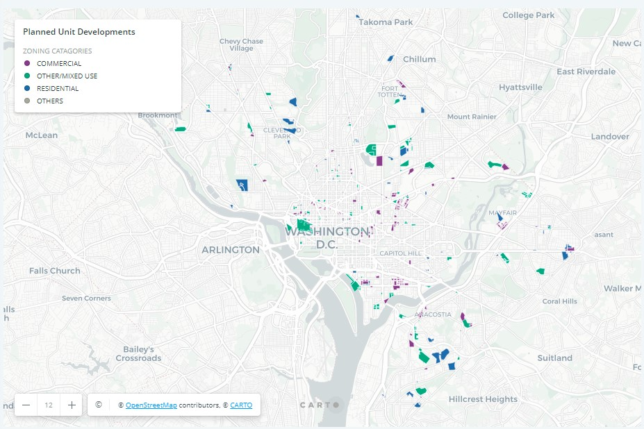

# Creating Zoning Maps Using Python & Pandas

This project is concerned with Planning Unit Developments (PUDs) in Washington D.C.  According to OpenData DC, PUDs are "large-scale development where conventional zoning standards are relaxed in order to promote the creation of public infastructure, conserve sensitive areas, and encourage a mix of land use types".  We would like to see where these PUDs intersect with areas of affordable housing in attempt to see the long term effectiveness of this policy.  The script within this repo performs this analysis as well as exports a shapefile of PUDs containing zoning classification and number of affordable housing units within each PUD.

## Data Inputs

One shapefile and two tables are used in this code:
1. A shapefile of Planning Unit Development is acquired from OpenData DC.
2. A .csv table of Affordable Housing Units is acquired from OpenData DC.
3. A zoning crosswalk .csv table, containing classification of zoning attributes, is contained in this repo.

## The Code

1. First, the GIS packages and modules that are needed in this process are downloaded and imported.  pandas, geopandas, spatialindex, shapely, and rtree are all needed.  The script contains comments on how these modules function.
2. Next, Google Colab is connected to a personal Google Drive account where the data is stored.  A root path is assigned to the data folder.
3. The PUDs shapefile is imported as a geodataframe with an inital coordinate system and both tables are imported.
4. A geometry field is added to the Affordable Housing table that contains the Point geometry type and x/y coordinates.  This table is then converted to a geodataframe.
5. The PUDs and Affordable Housing geodataframe are then joined based on a geographic intersection.
6. The joined geodataframe is then merged with the zoning class table to add a Zoning Catagory attribute.
7. The total number of PUDs is printed and the number of Affordable Housing Units within PUDs is printed.
8. Two maps are then displayed:  One is all PUDs according to zoning catagory. The second is all PUDs that contain affordable housing units.
9. Lastly, the joined and merged geodataframe is converted to a shapefile and exported to the personal Google Drive.

## Output

The exported shapefile is added to the CARTO webmapping platform.  The zoning classification is displayed for all Planning Unit Developments in Washington D.C. shown below:

The following is a link to the published Carto webmap:
https://mlazarz.carto.com/builder/fd50e265-6607-4ad9-b2f5-f82ab5b6073c/embed
